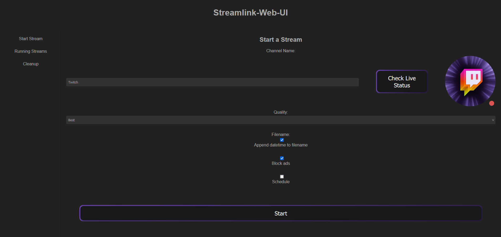
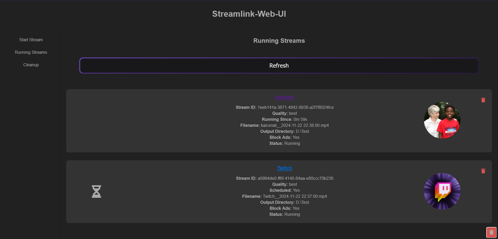

# Streamlink WebUI 

This Repository currently contains the API for an application which simplifies the download of Twitch Streams.

I used a FastAPI backend and a Vue.js frontend.

This project is in early-early alpha, so any reviews, bug reports or feature request are highly appreciated.

## Table of Contents

- [Streamlink WebUI](#streamlink-webui)
  - [Table of Contents](#table-of-contents)
  - [Features](#features)
  - [Showcase](#showcase)
    - [Start job section](#start-job-section)
    - [Running jobs section](#running-jobs-section)
- [Installation](#installation)
  - [Docker](#docker)
  - [Bare Metal](#bare-metal)
  - [Configuration](#configuration)
  - [API Endpoints](#api-endpoints)
  - [Logging](#logging)
  - [License](#license)
  - [License for Included Software](#license-for-included-software)
      - [Streamlink](#streamlink)
  - [Acknowledgements](#acknowledgements)


## Features

- Use a frontend to record Twitch streams.
- Schedule recordings to start automatically when a channel goes live.
- View all currently running or scheduled recordings.
- Display Twitch avatars.

## Showcase

### Start job section



### Running jobs section




# Installation

## Docker

Docker images are available on Docker Hub.

```bash
docker pull crazywolf13/streamlink-webui:latest
```

```bash
docker run -p 8000:8000 -dit \
  --name streamlink-webui \
  -e CLIENT_ID='your_client_id' \
  -e CLIENT_SECRET='your_client_secret' \
  -v /path/to/downloads:/app/downloads \
  crazywolf13/streamlink-webui
```


## Bare Metal

1. Clone the repository:
    ```bash
    git clone https://github.com/CrazyWolf13/streamlink-webui.git
    cd streamlink-webui/backend/src
    ```

2. Install the required packages:
    ```bash
    pip install -r requirements.txt
    ```

3. Build the frontend
    ```bash
    cd ../../frontend/src
    npm install
    npm install -g yarn
    yarn build
    ```

4. Create a Twitch API Key to fetch live status and user avatars:

  1. Go to the [Twitch Developer Portal](https://dev.twitch.tv/console/apps).
  2. Sign in if prompted.
  3. Click on "Register Your Application".
  4. Provide a name for your app and select "Application Integration".
  5. Enter `https://localhost` as the OAuth Redirect URL.
  6. You will receive a Client ID and Client Secret.
  7. In the root directory of the project, create a `.env` file and add the following:
```
CLIENT_ID='your_client_id'
CLIENT_SECRET='your_client_secret'
DOWNLOAD_PATH='/home/<your_username>/Download'
```

5. Run FastAPI:
    ```bash
    cd ../../backend/src
    fastapi run main.py
    ```

## Configuration

- The application uses Streamlink to handle the streams.
- The database is initialized with SQLAlchemy.
- Logs are stored in the `./logs` directory, and the database schema is configured in `db_schema.py`.

## API Endpoints

Visit /docs endpoint to get an overview of all api endpoints and how to use them.

## Logging

- Logs are created for each download task with detailed information about the streaming and recording process.
- Global logs are stored in `./logs/application-<date>.log`.
- Each download task gets its own log file named based on the stream's filename, stored in the `./logs` directory.


## License 

This project is licensed under the BSD 2-Clause License.

[License](./LICENSE)

## License for Included Software

#### Streamlink

This project is built upon software from the Streamlink project, which is licensed under the BSD 2-Clause License. See below for the full license text:
[Third-Party-Licenses](./third-party-licenses)

## Acknowledgements

We would like to thank the authors and maintainers of [Streamlink](https://github.com/streamlink/streamlink) for their excellent work at maintaining streamlink. Streamlink is invaluable to our project, and we appreciate your dedication to the open-source community.

Thank you!

---

Developed by CrazyWolf13 with ❤️
